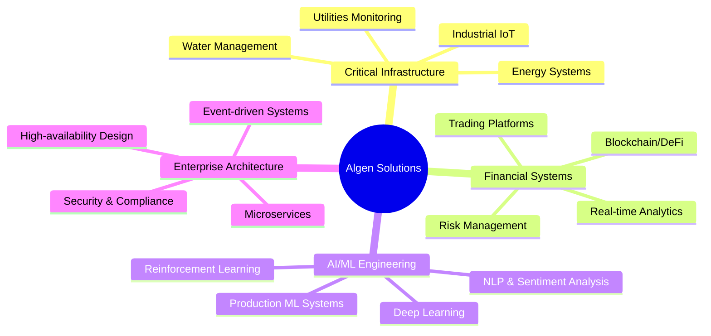

<div align="center">

# 🚀 Algen Solutions s.r.l.


### *Intelligent Solutions Through AI Innovation*

[](https://aigensolutions.it)
[](mailto:info@aigensolutions.it)
[](https://aigensolutions.it)


</div>

## 🎯 About Us

**Algen Solutions** is an Italian technology company specializing in **enterprise-grade software systems** for **critical infrastructure** and **mission-critical applications**. We design and deliver robust, scalable solutions that combine **artificial intelligence**, **advanced analytics**, and **industrial-strength architecture** to power essential systems across multiple sectors:



> 💡 **Our Mission**: Deliver production-ready, enterprise-grade AI and software systems that organizations can trust for their most critical operations, combining innovation with reliability and security.

## 💼 What We Do

<table>
<tr>
<td width="50%">

### 🏗️ Critical Infrastructure Systems
Enterprise-grade solutions for utilities, water management, and energy systems

**Key Areas:**
- **Water Infrastructure**: Advanced analytics for water networks and distribution
- **Energy Management**: Smart grid monitoring and optimization
- **Industrial IoT**: Sensor networks and real-time monitoring
- **Predictive Maintenance**: AI-driven failure prevention

</td>
<td width="50%">

### 💰 Mission-Critical Financial Systems
Production-ready trading platforms and DeFi systems built for reliability and scale

**Key Areas:**
- **Algorithmic Trading**: High-frequency, low-latency execution systems
- **Blockchain/DeFi**: Smart contracts and decentralized finance
- **Risk Management**: Real-time monitoring and automated protection
- **Market Intelligence**: AI-powered sentiment and technical analysis

</td>
</tr>
<tr>
<td width="50%">

### 🤖 Production ML/AI Engineering
Enterprise-grade machine learning systems designed for production environments

**Key Areas:**
- **Production ML Pipelines**: Scalable, monitored ML systems
- **Natural Language Processing**: Real-time text analysis and sentiment extraction
- **Reinforcement Learning**: Adaptive decision-making systems
- **Computer Vision**: Industrial quality control and monitoring

</td>
<td width="50%">

### 🏢 Enterprise Architecture
Robust, scalable systems built on modern software engineering principles

**Key Areas:**
- **Microservices Architecture**: Distributed, fault-tolerant systems
- **Event-driven Systems**: Real-time data processing at scale
- **High Availability**: 24/7 uptime for critical operations
- **Security & Compliance**: Enterprise-grade security protocols

</td>
</tr>
</table>

## 🌟 Featured Projects

<div align="center">

| 🎯 Project | 📝 Description | 🔧 Tech Stack | ⭐ Status |
|-----------|---------------|---------------|-----------|
| **[Abbanoa Water Analysis](https://github.com/AIgen-Solutions-s-r-l/abbanoa-water-analysis)** | Enterprise water infrastructure data analytics for Sardinian utility company |    |  |
| **[AlphaPulse](https://github.com/AIgen-Solutions-s-r-l/AlphaPulse)** | Real-time market sentiment analysis using AI to extract insights from news and social media |    |  |
| **[SpreadPilot](https://github.com/AIgen-Solutions-s-r-l/SpreadPilot)** | Modern microservices-based trading platform for scalable options trading automation |    |  |
| **[BofhContract](https://github.com/AIgen-Solutions-s-r-l/bofhcontract)** | Smart contract development and blockchain integration framework |    |  |
| **[HedgeLock](https://github.com/AIgen-Solutions-s-r-l/HedgeLock)** | Decentralized loan monitoring with automated liquidation protection |   |  |
| **[TEA](https://github.com/AIgen-Solutions-s-r-l/TEA)** | Technical Analysis & Event-driven Architecture for financial markets |   |  |
| **[HRLForLiving](https://github.com/AIgen-Solutions-s-r-l/HRLForLiving)** | Reinforcement learning system for optimal household resource allocation |   |  |

</div>

<details>
<summary>📖 Click to learn more about each project</summary>

### 💧 Abbanoa Water Analysis
> Enterprise-grade data analytics system for **Abbanoa**, Sardinia's primary water utility company. Advanced PostgreSQL-based analytics for water network monitoring, consumption patterns, leak detection, and infrastructure optimization. Built to handle millions of data points from a critical infrastructure serving hundreds of thousands of residents.

### 📰 AlphaPulse
> Production-ready market sentiment analysis platform that monitors news articles, social media, and financial publications in real-time. Uses advanced NLP and machine learning to extract actionable market insights and sentiment trends for institutional trading decisions.

### 📊 SpreadPilot
> Mission-critical trading platform built with microservices architecture for maximum scalability and reliability. Handles high-frequency options trading with millisecond-level latency requirements and advanced risk management for 24/7 operation.

### ⛓️ BofhContract
> Enterprise blockchain smart contract framework providing robust tools for contract development, testing, and deployment. Streamlines Web3 integration with enterprise-grade security, MEV protection, and best practices for DeFi applications.

### 🔒 HedgeLock
> Production blockchain-based DeFi monitoring system that provides real-time protection against liquidation risks. Intelligent algorithms monitor your positions 24/7 with automated intervention capabilities.

### 📈 TEA (Technical Event Architecture)
> High-performance market analysis engine that processes financial data streams in real-time and generates actionable trading signals using advanced technical analysis and event-driven architecture.

### 🏠 HRLForLiving
> AI-powered financial planning assistant using hierarchical reinforcement learning to optimize monthly budget allocation across savings, investments, and spending with adaptive learning capabilities.

</details>

## 🛠️ Enterprise Technology Stack

<div align="center">

### Core Languages & Frameworks


### Production ML/AI Stack


### Enterprise Databases & Time-Series


### Infrastructure & DevOps


### Blockchain & Web3


</div>

## 🏢 Enterprise-Grade Engineering

<div align="center">

```ascii
╔══════════════════════════════════════════════════════════════╗
║  "Mission-critical systems demand uncompromising quality"   ║
╚══════════════════════════════════════════════════════════════╝
```

</div>

Our software powers **critical infrastructure** and **high-stakes financial operations** where downtime is not an option. Every system we build adheres to enterprise-grade standards:

<table>
<tr>
<td width="50%" valign="top">

### 🔒 Production Reliability
- **High Availability**: 24/7 operation with fault-tolerant architecture
- **Real-time Monitoring**: Comprehensive observability and alerting
- **Data Integrity**: ACID compliance and robust backup strategies
- **Disaster Recovery**: Tested failover and recovery procedures

</td>
<td width="50%" valign="top">

### ⚡ Performance & Scalability
- **Low Latency**: Microsecond-level response times for critical paths
- **Horizontal Scaling**: Microservices architecture for elastic growth
- **Time-Series Optimization**: Specialized handling of high-frequency data
- **Load Testing**: Rigorous performance validation under stress

</td>
</tr>
<tr>
<td width="50%" valign="top">

### 🛡️ Security & Compliance
- **Defense in Depth**: Multi-layer security architecture
- **Encryption**: Data protection at rest and in transit
- **Access Control**: Role-based authentication and authorization
- **Audit Trails**: Comprehensive logging for compliance

</td>
<td width="50%" valign="top">

### 🔬 Quality Assurance
- **Automated Testing**: Comprehensive unit, integration, and E2E tests
- **CI/CD Pipelines**: Automated deployment with safety checks
- **Code Review**: Peer review and static analysis
- **Documentation**: Extensive technical documentation and runbooks

</td>
</tr>
</table>

### 🎯 Industries We Serve

Our systems operate in regulated and high-stakes environments:

- **🏭 Critical Infrastructure**: Water utilities, energy grids, industrial monitoring
- **💼 Financial Services**: Trading platforms, DeFi protocols, risk management
- **🏛️ Public Sector**: Municipal utilities, government data analytics
- **🏢 Enterprise**: Large-scale data processing and AI/ML systems

## 🌍 Open Source Philosophy

<div align="center">

```ascii
╔═══════════════════════════════════════════════════════════╗
║  "Innovation thrives in communities that share knowledge" ║
╚═══════════════════════════════════════════════════════════╝
```

</div>

We believe in contributing to the open-source community. Many of our projects are publicly available, and we welcome collaboration from developers worldwide. Together, we build better solutions.

## 🤝 Get Involved

<table>
<tr>
<td width="33%" align="center">

### 💻 Contribute
Check out our [Contributing Guidelines](https://github.com/AIgen-Solutions-s-r-l/.github/blob/main/CONTRIBUTING.md)

</td>
<td width="33%" align="center">

### 🐛 Report Issues
Found a bug? Open an issue in the relevant repository

</td>
<td width="33%" align="center">

### 💬 Discuss
Join our discussions to share ideas and feedback

</td>
</tr>
<tr>
<td width="33%" align="center">

### 📖 Documentation
Help improve our docs and tutorials

</td>
<td width="33%" align="center">

### ⭐ Star Projects
Show support by starring repositories you find useful

</td>
<td width="33%" align="center">

### 📜 Code of Conduct
Please read our [Code of Conduct](https://github.com/AIgen-Solutions-s-r-l/.github/blob/main/CODE_OF_CONDUCT.md)

</td>
</tr>
</table>

---

<div align="center">

## 📬 Contact Us

<a href="https://aigensolutions.it">
  
</a>
<a href="mailto:info@aigensolutions.it">
  
</a>
<a href="https://aigensolutions.it">
  
</a>

---

### 📊 GitHub Stats


---


**© 2025 Algen Solutions s.r.l. | Empowering the future through AI**

</div>
