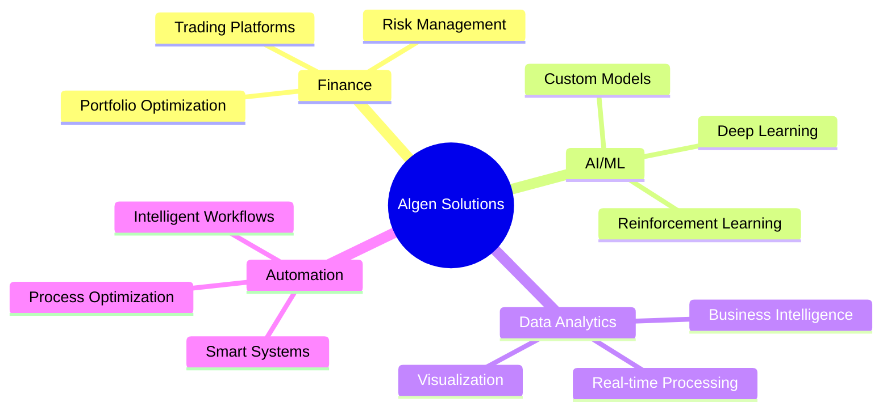

<div align="center">

# 🚀 Algen Solutions s.r.l.


### *Intelligent Solutions Through AI Innovation*

[](https://aigensolutions.it)
[](mailto:info@aigensolutions.it)
[](https://aigensolutions.it)


</div>

## 🎯 About Us

**Algen Solutions** is an innovative Italian company at the forefront of **artificial intelligence** and **machine learning**. We craft cutting-edge software systems that harness the power of AI to solve complex challenges across multiple domains:



> 💡 **Our Mission**: Democratize access to advanced AI technologies, making them accessible and practical for businesses of all sizes.

## 💼 What We Do

<table>
<tr>
<td width="50%">

### 🤖 AI/ML Solutions
Custom machine learning models and AI-powered applications tailored to your needs

**Key Areas:**
- Deep Learning Models
- Computer Vision
- Natural Language Processing
- Predictive Analytics

</td>
<td width="50%">

### 💰 Financial Technology
Trading platforms, risk management, and automated financial systems

**Key Areas:**
- Algorithmic Trading
- Risk Assessment
- Portfolio Management
- Market Analysis

</td>
</tr>
<tr>
<td width="50%">

### 📊 Data Analytics
Advanced data processing, analysis, and visualization tools

**Key Areas:**
- Business Intelligence
- Real-time Processing
- Data Visualization
- Statistical Analysis

</td>
<td width="50%">

### ⚡ Smart Automation
Intelligent systems that learn and adapt to optimize business processes

**Key Areas:**
- Process Optimization
- Workflow Automation
- Intelligent Agents
- Adaptive Systems

</td>
</tr>
</table>

## 🌟 Featured Projects

<div align="center">

| 🎯 Project | 📝 Description | 🔧 Tech Stack | ⭐ Status |
|-----------|---------------|---------------|-----------|
| **[SpreadPilot](https://github.com/AIgen-Solutions-s-r-l/SpreadPilot)** | Modern microservices-based trading platform for scalable options trading automation |    |  |
| **[HedgeLock](https://github.com/AIgen-Solutions-s-r-l/HedgeLock)** | Decentralized loan monitoring with automated liquidation protection |   |  |
| **[TEA](https://github.com/AIgen-Solutions-s-r-l/TEA)** | Technical Analysis & Event-driven Architecture for financial markets |   |  |
| **[HRLForLiving](https://github.com/AIgen-Solutions-s-r-l/HRLForLiving)** | Reinforcement learning system for optimal household resource allocation |   |  |

</div>

<details>
<summary>📖 Click to learn more about each project</summary>

### 📊 SpreadPilot
> A sophisticated trading platform built with microservices architecture for maximum scalability and reliability. Handles high-frequency options trading with advanced risk management.

### 🔒 HedgeLock
> Blockchain-based DeFi monitoring system that provides real-time protection against liquidation risks. Intelligent algorithms monitor your positions 24/7.

### 📈 TEA (Technical Event Architecture)
> Real-time market analysis engine that processes financial data streams and generates actionable trading signals using advanced technical analysis.

### 🏠 HRLForLiving
> AI-powered financial planning assistant using hierarchical reinforcement learning to optimize your monthly budget allocation across savings, investments, and spending.

</details>

## 🛠️ Technology Stack

<div align="center">

### Languages & Frameworks


### AI/ML & Data Science


### Databases & Storage


### Cloud & DevOps


</div>

## 🌍 Open Source Philosophy

<div align="center">

```ascii
╔═══════════════════════════════════════════════════════════╗
║  "Innovation thrives in communities that share knowledge" ║
╚═══════════════════════════════════════════════════════════╝
```

</div>

We believe in contributing to the open-source community. Many of our projects are publicly available, and we welcome collaboration from developers worldwide. Together, we build better solutions.

## 🤝 Get Involved

<table>
<tr>
<td width="33%" align="center">

### 💻 Contribute
Check out our [Contributing Guidelines](https://github.com/AIgen-Solutions-s-r-l/.github/blob/main/CONTRIBUTING.md)

</td>
<td width="33%" align="center">

### 🐛 Report Issues
Found a bug? Open an issue in the relevant repository

</td>
<td width="33%" align="center">

### 💬 Discuss
Join our discussions to share ideas and feedback

</td>
</tr>
<tr>
<td width="33%" align="center">

### 📖 Documentation
Help improve our docs and tutorials

</td>
<td width="33%" align="center">

### ⭐ Star Projects
Show support by starring repositories you find useful

</td>
<td width="33%" align="center">

### 📜 Code of Conduct
Please read our [Code of Conduct](https://github.com/AIgen-Solutions-s-r-l/.github/blob/main/CODE_OF_CONDUCT.md)

</td>
</tr>
</table>

---

<div align="center">

## 📬 Contact Us

<a href="https://aigensolutions.it">
  
</a>
<a href="mailto:info@aigensolutions.it">
  
</a>
<a href="https://aigensolutions.it">
  
</a>

---

### 📊 GitHub Stats


---


**© 2025 Algen Solutions s.r.l. | Empowering the future through AI**

</div>
